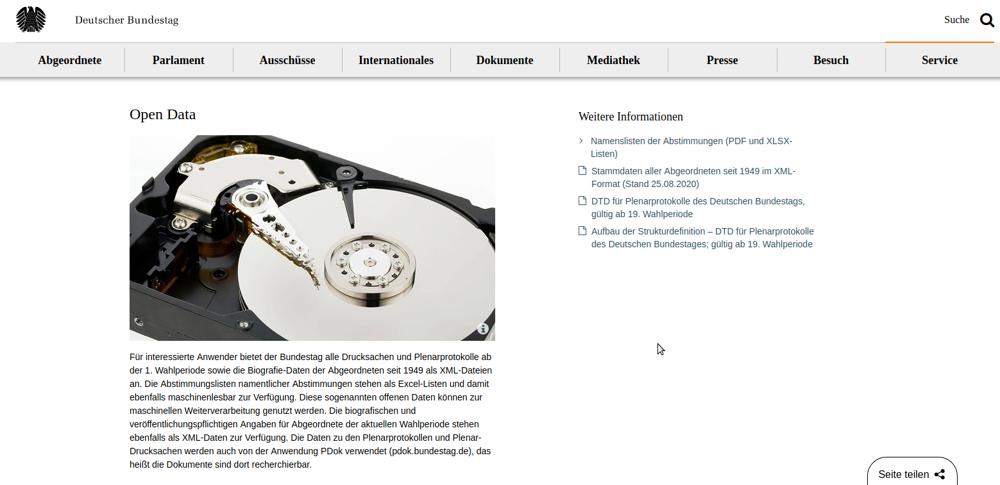
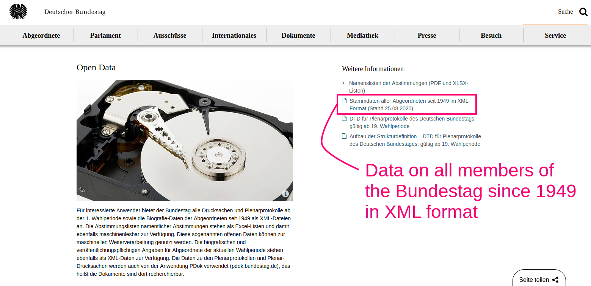

```{r setup, include=FALSE}
knitr::opts_chunk$set(echo = FALSE)
```

## Making the Bundestag open data more accessible 

>- The Bundestag distributes biographical and election data on all its members since 1949.
>- The data is only available in **XML**, a format difficult to work with.
>- **btmembers** is a tool designed to make the the Bundestag open data more accessible.

## Website



## Website



## Problem

>- Data is stored as an XML file 
>- XML files have a tree-like structure
>- Arbitrary number of dimensions

## A look at the original data

```
MDB
  |-> ID
  |-> NAMEN
    |-> NAME (+)
      |-> NACHNAME
      |-> ...
  |-> BIOGRAFISCHE_ANGABEN
    |-> GEBURTSDATUM
    |-> ...
  |-> WAHLPERIODEN
    |-> WAHLPERIODE (+)
      |-> WP
      |-> ...
      |-> INSTITUTIONEN
        |-> INSTITUTION (+)
          |-> INSART_LANG
          |-> ..
```

## btmembers: facilitating comparison between multiple members

>- XML data is problematic if we want to **compare** multiple members
>- Faced with this problem while working on _Smarte Spalter_ (Chap. 10: Schroeder, Weßels, and Joly, 2019).
>- btmembers makes the procedure reproducible and accessible to everyone. 

## btmembers: what it does

>- btmembers imports the file "Stammdaten aller Abgeordneten seit 1949 im XML-Format" and turn it into a rectangular dataset.
>- Unit of analysis: member-term
>- Only the most recent names are preserved.
>- "Functions" are not reported. 

## Installation

>- btmembers is currently hosted on Github.

```{r install, echo = TRUE, eval = FALSE}
# install.packages("devtools")
devtools::install_github("jolyphil/btmembers")
```

## Preloaded data

- btmembers comes preloaded with the processed tabular dataset.
- Data is stored in the `members` object

```{r preloaded_data, echo = TRUE, eval = FALSE}
library(btmembers)
members
```

```{r preloaded_data_kable, message = FALSE}
library(btmembers)
library(dplyr)
library(kableExtra)
library(knitr)
members %>% 
  filter(id == "11001478") %>% 
  select(id, nachname, vorname, geburtsdatum, wp, mdbwp_von) %>%
  kable() %>%
  kable_styling(latex_options="scale_down")
```


